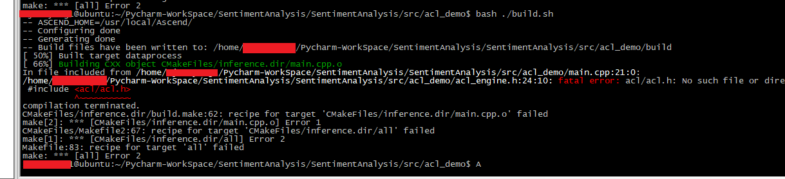
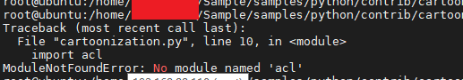
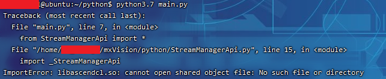
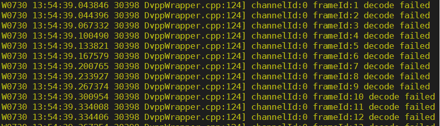
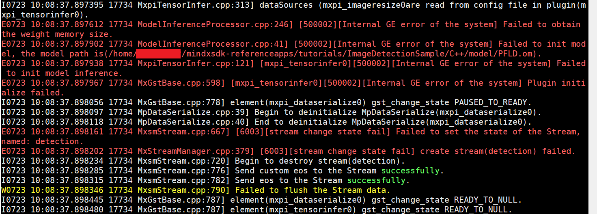
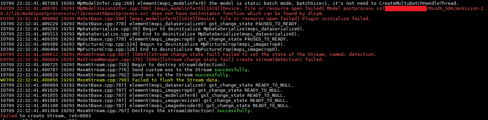
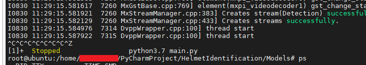

# 目录

- [环境安装配置](#1-环境安装配置)
- [视频图像编解码](#2-视频图像编解码)
- [模型训练](#3-模型训练)
- [模型转换推理](#4-模型转换推理)
- [SDK运行](#5-SDK运行)
- [pr提交](#6-PR提交)
- [python版本](#7-python版本)

# 1 环境安装配置

## 1.1 项目编译缺少acl头文件

### 现象描述



### 可能原因

缺少头文件所在库路径

### 处理方法

方法1：

在CMakeLists.txt文件中的相应位置添加对应路径


方法2：

导入环境变量

```
export LD_LIBRARY_PATH=/usr/local/Ascend/ascend-toolkit/latest/acllib/lib64:${LD_LIBRARY_PATH}
```


## 1.2 python脚本缺少acl模块

### 现象描述



### 可能原因

缺少环境变量

### 处理方法

导入环境变量

```
export PYTHONPATH=/usr/local/Ascend/ascend-toolkit/latest/pyACL/python/site-packages/acl:${PYTHONPATH}
```


## 1.3 python脚本ImportError: libascendcl.so: cannot open shared object file: No such file  or directory

### 现象描述



### 可能原因

缺少环境变量

### 处理方法

导入环境变量

```
export LD_LIBRARY_PATH=/usr/local/Ascend/ascend-toolkit/latest/acllib/lib64:${LD_LIBRARY_PATH}
```


# 2 视频图像编解码

## 2.1 Dvpp解码视频帧失败

### 现象描述



### 可能原因

Dvpp只支持对yuv420图像的解码，当视频不是yuv420时，则解码失败

### 处理方法

使用ffmpeg或其他工具将视频流转换为yuv420格式

## 2.2 jpg图片解码失败

### 现象描述

推理jpg格式图片仍出现如下报错


### 可能原因

通过更改文件后缀名的方式强制修改图片格式可能会失败，采用一些格式查看工具会发现图片仍是原工具

### 处理方法

使用格式转换工具修改图片格式

# 3 模型训练

## 3.1 模型训练时报libtorch_npu.so: undefined symbol: aclopSetCompileFlag错误

### 现象描述


### 可能原因

环境中的pytorch版本与toolkit版本不匹配，或存在多个tookit版本，环境变量未正确指定。

### 处理方法

    1）重新安装版本匹配的torch或者toolkit。
    2）重新设置环境变量，指定正确的toolkit路径。

## 3.2 导入mindspore包时提示libgraph.so文件找不到

### 现象描述


### 可能原因

缺失环境变量

### 处理办法

添加mindspore的环境变量

```
export GLOG_v=2
LOCAL_ASCEND=/usr/local/Ascend # the root directory of run package

export LD_LIBRARY_PATH=${LOCAL_ASCEND}/ascend-toolkit/latest/fwkacllib/lib64:${LOCAL_ASCEND}/driver/lib64:${LOCAL_ASCEND}/ascend-toolkit/latest/opp/op_impl/built-in/ai_core/tbe/op_tiling:${LD_LIBRARY_PATH}

export TBE_IMPL_PATH=${LOCAL_ASCEND}/ascend-toolkit/latest/opp/op_impl/built-in/ai_core/tbe           
export ASCEND_OPP_PATH=${LOCAL_ASCEND}/ascend-toolkit/latest/opp                                   
export PATH=${LOCAL_ASCEND}/ascend-toolkit/latest/fwkacllib/ccec_compiler/bin/:${PATH}          
export PYTHONPATH=${TBE_IMPL_PATH}:${PYTHONPATH}   
```

将上述代码拷贝至 env_ms.sh，执行source env_ms.sh

# 4 模型转换推理

## 4.1 推理插件报错Input image size[xxx]  should be equal to model image size[xxx]

### 现象描述


### 可能原因

输入图片大小与模型要求输入大小不匹配

### 处理办法

调整aipp中的input_format参数，计算方式如下图所示


## 4.2 推理插件报错The datasize of concated inputTensor[0] (xxxx) does not match model inputTensor[0] (xxxx). Tensor Dtype:XXX. model Dtype:XXX. 

### 现象描述


### 可能原因

输入的图像数据类型与模型要求输入数据类型不匹配

### 处理办法

根据项目实际需求调整输入数据的类型或者更改模型转换时模型输入数据类型

## 4.3 benchmark工具报错Input data size don't match the model input size

### 现象描述


### 可能原因

配置有aipp的模型要求输入图片格式应与aipp配置文件中的input_format参数值对齐

### 处理办法

将图片转换为input_format参数值相同的格式

## 4.4 推理模型加载模型失败

### 现象描述



### 可能原因

模型路径包含有是不能被识别的符号“+”

### 处理办法

更换模型路径

# 5 SDK运行

## 5.1 项目运行时does not have GetInstance function which can be found by dlsym报错

### 现象描述



### 可能原因

后处理插件与推理插件不匹配

### 处理办法

例如 与图中的resnet后处理插件配套的推理插件为tensorinfer插件，pipeline中需使用mxpi_tensorinfer

## 5.2 项目运行时The type of metadata(MxpiTensorPackageList) is noe match to designed(MxpiVisionList)

### 现象描述

预处理不使用sdk插件，在外部构造好可推理数据后传入流中报错


### 可能原因

后处理插件需要来自缩放插件的信息（resizedImageInfos），但是pipeline中只挂载了推理插件输出结果（MxpiTensorPackageList），后处理插件无法获取到对应的数据

### 处理方法

手动构造缩放插件输出数据（MxpiVisionList），一起传入pipeline中

## 5.3 使用getprotobuf输出接口时程序阻塞且无法正常退出

### 现象描述



### 可能原因

Getprotobuf是阻塞式接口，若该接口无法从pipeline流中获得数据，则会出现阻塞情况，也无法正常退出程序

### 处理方法

方法一：若上游插件输出只有单一数据时，换用GetResult非阻塞式接口

方法二：若上游插件输出有多类别数据，且存在因无法处理导致阻塞的数据时，使用distributor与fakesink插件，将不需要的类别通过distributor传送给fakesink销毁掉。避免阻塞。

## 5.4 使用opencv处理图片失败

### 现象描述

使用opencv处理图像数据失败

### 可能原因

Sdk解码图像数据后会将数据转移至device侧，进行后续的推理等动作；而Opencv只能处理host侧的数据

### 处理方法

将数据转移至host侧

```
1. APP_ERROR ret = tensorBase.ToHost();
2. MxBase::MemoryData memoryDst(resultInfo->size,MxBase::MemoryData::MEMORY_HOST_NEW);
```


## 5.5 使用mxpi_modelinfer插件，用输出接口获取结果失败

### 现象描述

使用Getprotobuf代码报错


使用GetResultWithUniqueId获取结果为空


### 可能原因

modelinfer更多适配于老框架的模型推理与后处理

### 处理方法

新框架将推理与后处理分开设计，常用mxpi_tensorinfer插件完成推理

## 5.6 项目后处理插件报错Model postprocess so() does not have GetObjectInstancefunction. Please check the correspondence between modelpostprocess plugin and postprocess.so

### 现象描述


### 可能原因

使用的后处理插件与模型输入不适配

### 处理方法

方法1:

查看lib或lib/modelpostprocess路径下是否有相功能后处理插件，切换使用

方法2:

尝试方法1失败，说明当前sdk中没有包含与使用模型适配的后处理插件，需要自己开发

# 6 PR提交

## 6.1 ci-pipeline-failed

### 现象描述

PR界面显示ci-pipeline-failed标签，但Code Check后的链接点击跳转失败


### 可能原因

服务器本身缺陷

### 处理办法

评论区评论rebuild，重新触发检查

## 6.2 ascend-cla/no

### 现象描述

签署完cla协议后仍然显示ascend-cla/no标签提示

### 可能原因

代码提交时使用的邮箱是没有签署cla协议的邮箱

### 处理办法

参考以下链接检查提交的邮箱记录并修改

[test-infra/faq.md at sync-5-22 · opensourceways/test-infra (github.com)](https://github.com/opensourceways/test-infra/blob/sync-5-22/prow/gitee-plugins/cla/faq/check-by-author/faq.md)

## 6.3 提交代码后无法触发门禁检查Build Result与Code Check

### 现象描述


### 可能原因

PR与主仓存在冲突


### 处理办法

解决冲突后即可正常触发检查

# 7 python版本

## 7.1 运行时提示python版本过低

### 现象描述

运行时报错  
`Exception: StreamManagerApi only support python3.7 or greater
`

### 可能原因

SDK 2.0.2版本python要求版本为3.7.5+，使用低版本时会出现以上问题

### 处理办法

1. 手动修改run.sh中调用命令的python版本  
`python3 -> python3.7`
2. 修改系统python3的软链接版本
```shell
sudo rm -rf /usr/bin/python3
sudo ln -s /usr/bin/python3.7.5  /usr/bin/python3
```

## 7.2 运行时提示缺失组件

### 现象描述

运行时报错  
`undefined symbol: PyCMethod_New
`

### 可能原因

SDK 2.0.4版本python要求版本为3.9.2+，使用低版本时会出现以上问题

### 处理办法

1. 手动修改run.sh中调用命令的python版本  
`python3 -> python3.9`
2. 修改系统python3的软链接版本
```shell
sudo rm -rf /usr/bin/python3
sudo ln -s /usr/bin/python3.9.2  /usr/bin/python3
```