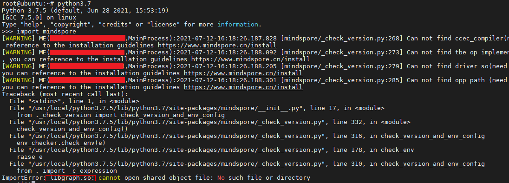

# MindX_SDK参考设计开发常见问题FAQ
- [MindX_SDK参考设计开发常见问题FAQ](#mindx_sdk参考设计开发常见问题faq)
- [1 介绍](#1-介绍)
- [2 常见问题FAQ](#2-常见问题faq)
  - [2.1 环境使用常见问题FAQ](#21-环境使用常见问题faq)
    - [FAQ1、模型训练时报libtorch_npu.so: undefined symbol: aclopSetCompileFlag错误](#faq1模型训练时报libtorch_npuso-undefined-symbol-aclopsetcompileflag错误)
    - [FAQ2、driver安装crl报错](#faq2driver安装crl报错)
    - [FAQ3、导入mindspore包时提示libgraph.so文件找不到](#faq3导入mindspore包时提示libgraph.so文件找不到)

# [1 介绍](#1-介绍)

    本文目标读者为Ascend MindX_SDK参考设计开发者，这里仅列举开发中遇到的常见问题与解决方法，持续更新。

# [2 常见问题FAQ](#2-常见问题faq)

## [2.1 环境使用常见问题FAQ](#21-环境使用常见问题faq)

### FAQ1、模型训练时报libtorch_npu.so: undefined symbol: aclopSetCompileFlag错误。

* 现象描述


* 原因分析

    环境中的pytorch版本与toolkit版本不匹配，或存在多个tookit版本，环境变量未正确指定。

* 处理方法

    1）重新安装版本匹配的torch或者toolkit。
    2）重新设置环境变量，指定正确的toolkit路径。

### FAQ2 driver安装crl报错


* 原因目录


* 原因分析
   
老版本的安装信息 /root/ascend_check 存在，driver安装前校验无法通过

* 处理方法
   
删除这个文件

### FAQ3 导入mindspore包时提示libgraph.so文件找不到



* 原因分析

缺失环境变量

*处理办法

添加mindspore的环境变量

```
export GLOG_v=2
LOCAL_ASCEND=/usr/local/Ascend # the root directory of run package
export LD_LIBRARY_PATH=${LOCAL_ASCEND}/ascend-toolkit/latest/fwkacllib/lib64:${LOCAL_ASCEND}/driver/lib64:${LOCAL_ASCEND}/ascend-toolkit/latest/opp/op_impl/built-in/ai_core/tbe/op_tiling:${LD_LIBRARY_PATH}

export TBE_IMPL_PATH=${LOCAL_ASCEND}/ascend-toolkit/latest/opp/op_impl/built-in/ai_core/tbe           
export ASCEND_OPP_PATH=${LOCAL_ASCEND}/ascend-toolkit/latest/opp                                   
export PATH=${LOCAL_ASCEND}/ascend-toolkit/latest/fwkacllib/ccec_compiler/bin/:${PATH}          
export PYTHONPATH=${TBE_IMPL_PATH}:${PYTHONPATH}   
```

