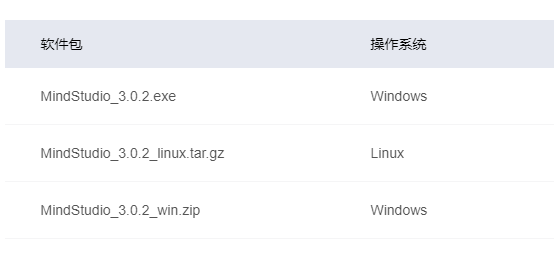
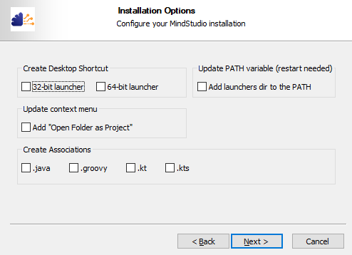
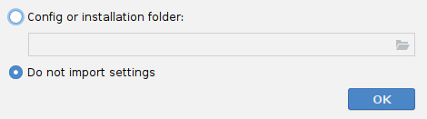
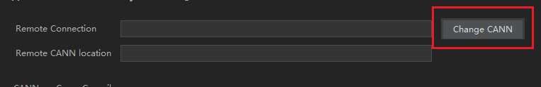
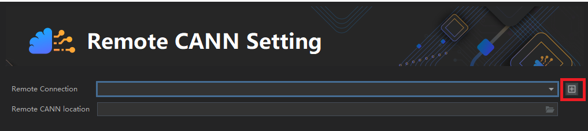
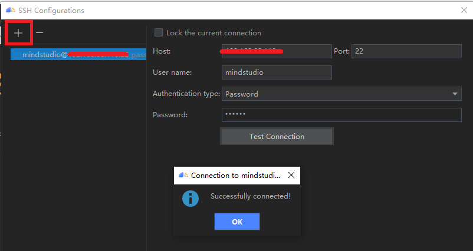
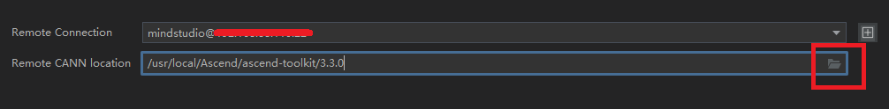
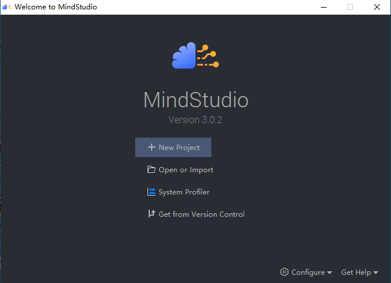
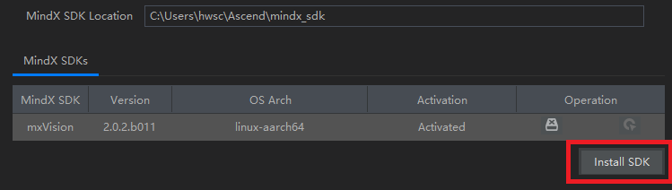
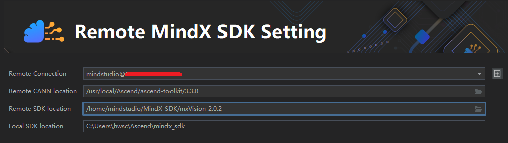

# 基于MindStuido的SDK应用开发环境搭建

## 安装前准备

将MindStudio安装在Windows服务器上时，Windows服务器为本地环境，Linux服务器为远端环境。

#### 本地环境要求

Windows 10 x86_64操作系统

#### 本地安装依赖

- JDK 11
- Python3.7.5
- MinGW
- CMake

具体安装步骤参考https://support.huaweicloud.com/devg-mindstudio302/atlasms_02_0423.html

## 安装MindStudio

**步骤1**  [MindStudio下载链接](https://www.hiascend.com/software/mindstudio/download)，下载Window系统的安装包，下载完成后点击下载的安装包安装MindStudio

**步骤2**  在下图安装界面，用户根据需要勾选安装选项后，单击“Next”

- Create Desktop Shortcut：创建桌面快捷方式，用户可根据系统配置选择“32-bit launcher”或者“64-bit launcher”。
- Update PATH variable(restart needed)：将MindStudio的启动文件路径加入环境变量PATH中，可从系统命令行直接启动MindStudio。如果勾选此项，MindStudio安装配置完成后会重启操作系统。
- Update context menu：勾选“Add "Open Folder as Project"”后，右键单击文件夹，可以作为MindStudio工程打开。
- Create Associations：默认不勾选。

**步骤3**  安装完成后，启动MindStudio，进入导入设置界面，根据需要选择相关选项后，单击“OK”，进入下一步。

- Config or installation folder：表示从自定义配置目录导入MindStudio设置。

  自定义配置目录所在路径：C:\Users\*个人用户*\AppData\Roaming\MindStudioMS-*{version}*，MindStudio设置包括工程界面的个性化设置（例如背景色等信息）等。

- Do not import settings：不导入设置，若选择该选项，则创建新的配置文件，默认为该选项。

**步骤4**  选择Configure ->CANN Manager，安装如图所示步骤连接MindStudio所在Windows环境与Ascend-cann-toolkit开发套件包所在远程开发环境。

按照如图所示路径连接toolkit开发套件包，选择5.0.4可成功连接版本，点击Finish。

如果没有报错信息且能正常进入欢迎界面，则表示MindStudio安装成功

**步骤5**  Configure ->Settings ->Plugins，搜索并安装如下插件工具。

- Grep Console
- Pylint
- Python Community Edition

**步骤6**  点击Configure ->Settings ->Appearance & Behavior ->System Settings ->MindX SDK，连接远程SDK。

#### **以上步骤全部完成且没有报错信息，表示MindStudio开发环境已成功搭建。**

