# 2.2 基于MindStuido的图像检测sample样例运行

[样例获取](https://gitee.com/ascend/mindxsdk-referenceapps/tree/master/tutorials/ImageDetectionSample)

## 2.2.1 运行前准备

参考[MindStuido开发环境搭建](./1-3MindStuido开发环境搭建.md)章节搭建好项目运行环境。

参考[Cmake介绍](./Cmake介绍.md)修改CMakeLists.txt文件。

### 2.2.1.1 模型转换

在ModelZoo上下载YOLOv3模型 ，选择“历史版本”中版本1.1下载。[下载地址](https://www.hiascend.com/zh/software/modelzoo/detail/2/24a26134237f41a3974978d249451d19)
下载后将模型上传至远程服务器。

#### 模型转换入口

可以通过如下两种方式进入模型转换界面。

- 在菜单栏选择“Ascend > Model Converter”。
- 在菜单栏选择“View > Appearance > Toolbar”，菜单栏下方会出现一行工具栏，选择。

#### 转换前提

进行模型转换前，使用MindStudio安装用户，将所转换模型的模型文件、权重文件以及模型转换所需的AIPP配置文件 _（如果需要则上传，若没有也可通过MindStudio的模型转换--“Data Pre-Processing”配置数据预处理功能生成）_ 上传到Ascend-cann-toolkit开发套件包所在的开发环境。

#### 转换步骤

> 本文档的模型转换步骤以图像检测项目所需的模型为例进行操作，MindStudio模型转换工具的详细使用和参数说明请参考[MindStudio用户手册--模型转换](https://support.huaweicloud.com/usermanual-mindstudio302/atlasms_02_0059.html)

**步骤1** 打开模型转换页面，在“Model Information”页签中上传模型文件，加载成功后，会自动填充下列参数信息，Model Name是生成的om模型文件名称,用户可以根据需要自行修改名称

​           修改input/input_data参数值为"1,416,416,3"

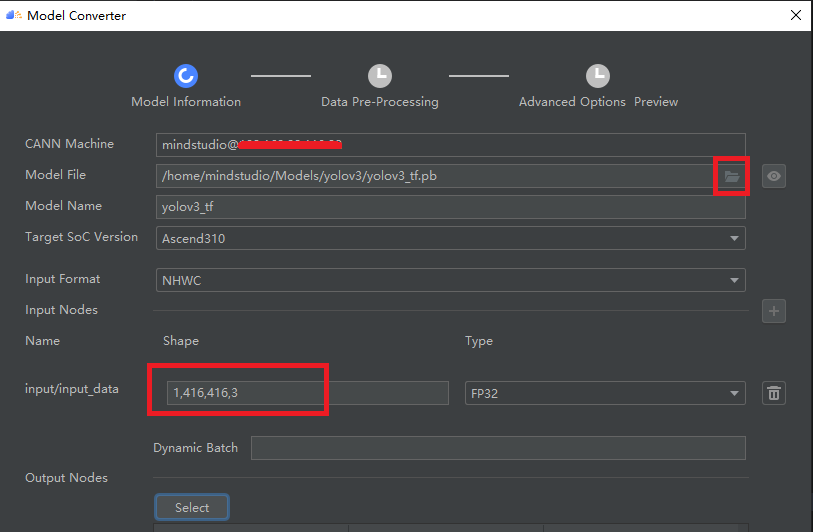


**步骤2** 点Output Nodes->Select，指定输出节点

​           在搜索栏输入conv_lbbox/BiasAdd、conv_mbbox/BiasAdd、conv_sbbox/BiasAdd，找到指定节点，右击选择“Select”，该层变成蓝色，单击“OK”后，在“Output Nodes”参数下面会看到标记层的算子

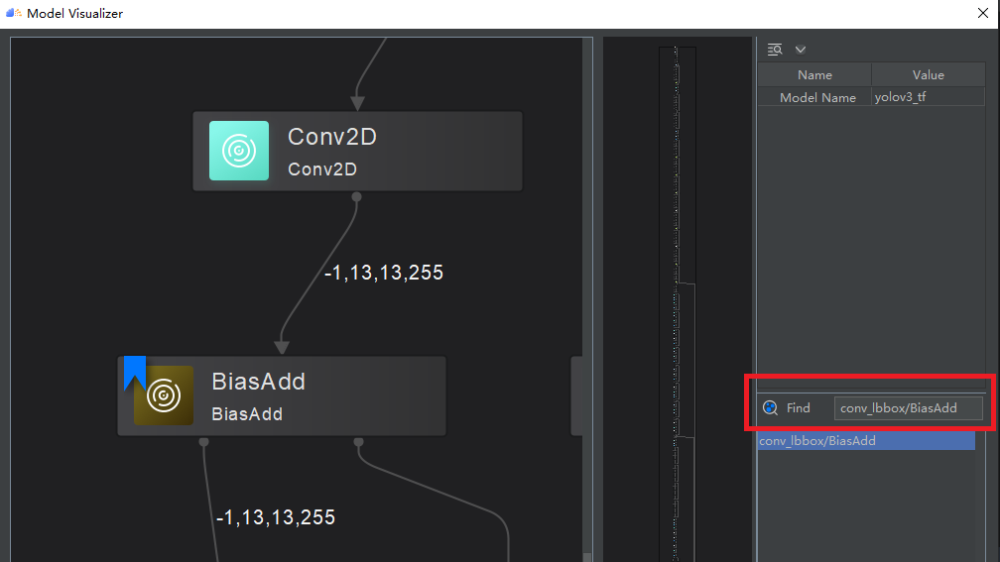

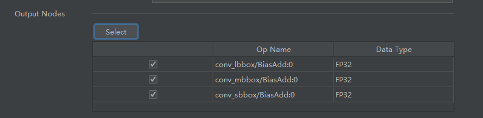

**步骤3** 单击“Next”，进入“Data Pre-Processing”配置数据预处理页。因为我们已提供了模型转化所需的AIPP配置文件，所以并不需要进行这一步的配置，可直接关掉Data Preprocessing，再次单击“Next”

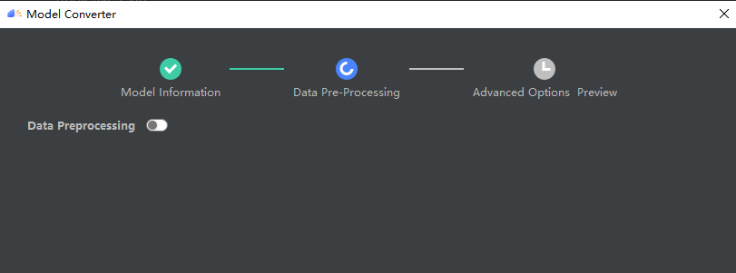

**步骤4** 进入“Advanced Options Preview”高级选项配置页，在Additional Arguments添加转换参数

```
--insert_op_conf=${配置文件上传路径}/aipp_yolov3_416_416.aippconfig
```

​           Command Preview展示了模型转换使用的atc参数预览

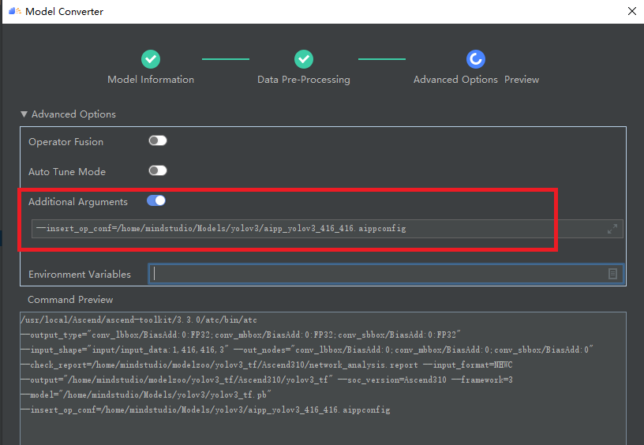

**步骤5** 单击Finish开始模型转换，在MindStudio界面下方，“Output”窗口会显示模型转换过程中的日志信息，如果提示**“Model converted successfully”**，则表示模型转换成功。“Output”窗口会显示模型转换所用的命令、所设置的环境变量、模型转换的结果、模型输出路径以及模型转换日志路径等信息。

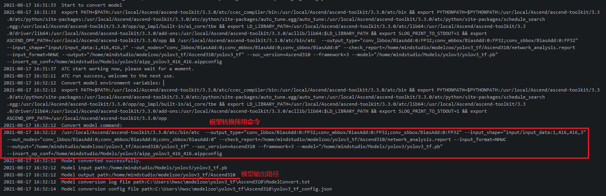

### 2.2.1.2 导入项目文件

启动MindStudio，导入下载的图像检测样例（模型文件已放入）


导入配置按下图选择：

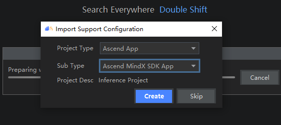

### 2.2.1.3 配置pipeline

在test.pipeline文件中配置所需的模型路径与模型后处理插件路径。  
  

  

后插件路径根据SDK安装路径决定，一般情况下无需修改。
运行时如果出现找不到插件的报错，可以通过`find -name libyolov3postprocess.so`搜索找到路径后再更改pipeline中的值。  


### 2.2.1.4 配置环境变量

在远程环境中使用*env*指令查看所需环境变量值，请仔细检查自己的环境变量与所给的环境变量是否有差别，若缺少路径，执行*vi .bashrc*命令，在.bashrc文件中添加缺少的环境变量。保存退出后，执行*source ~/.bashrc*命令使环境变量生效。

```
MX_SDK_HOME=${SDK安装路径}
LD_LIBRARY_PATH=${MX_SDK_HOME}/lib:${MX_SDK_HOME}/opensource/lib:${MX_SDK_HOME}/opensource/lib64:/usr/local/Ascend/ascend-toolkit/latest/acllib/lib64:/usr/local/Ascend/driver/lib64/
GST_PLUGIN_SCANNER=${MX_SDK_HOME}/opensource/libexec/gstreamer-1.0/gst-plugin-scanner
GST_PLUGIN_PATH=${MX_SDK_HOME}/opensource/lib/gstreamer-1.0:${MX_SDK_HOME}/lib/plugins
```

## 2.2.2 C++样例

**步骤1** 点击Build -> Build Configurations

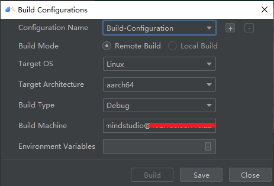

点击Build，编译成功后生成可执行文件sample


**步骤2** 点击Run ->Edit Configurations，添加可执行文件路径

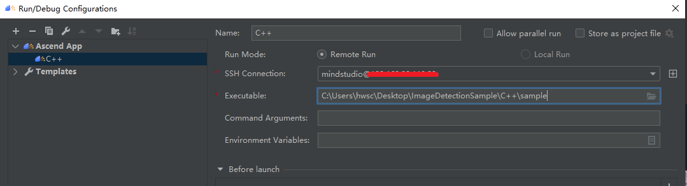

**步骤3** 点击Run运行项目，得到检测结果


### Tips：关于使用MindStudio开发C++项目的配置信息

- 远程映射路径

  点击Ascend ->Device Manager，Remote Work Path是项目同步到远程环境的父目录，双击可修改

  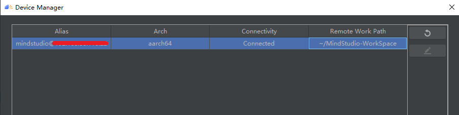

  映射的远程项目文件由MindStudio自动生成在父目录下

  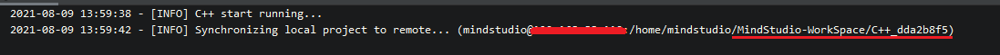

- MindStudio会在编译C++项目时将所有文件同步到远侧映射路径中，若两端文件不一致，本地文件会覆远程文件，本地不存在而只有服务器存在的文件也会被删除。

## 2.2.3 python样例

> 由于目前MindStudio链接远程python服务器的功能正在开发中，目前仅支持使用MindStudio实现python项目两端代码同步，项目运行依然需要再服务器上实现。

**步骤1** 参考运行前准备部分内容将项目文件导入MindStudio中，pipeline在脚本main.py内部

**步骤2** File ->Settings ->Tools ->Deploy，点击Mappings，根据下图操作顺序设置远程映射路径

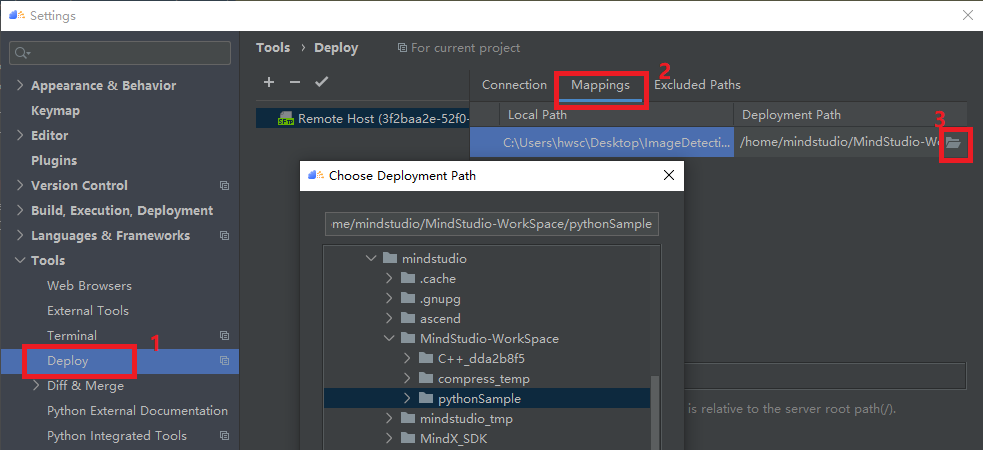

**步骤3** 右击项目根目录文件夹，点击Deployment ->upload to...选择上传服务器，上传项目文件；点击Deployment ->download to...可将远程文件下载到本地

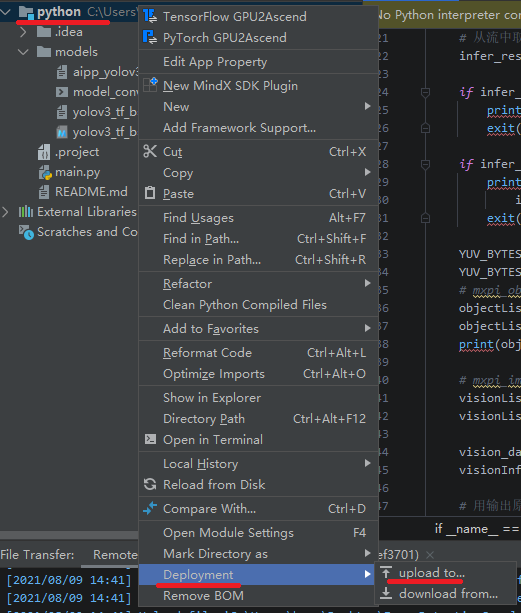

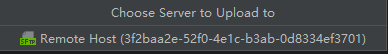

​           这一步设置成功后，便可以在IDE中修改代码，修改后重复上传操作，实同步两端项目文件；若只修改了单个文件，也可以右键单击修改文件，重复上述步骤上传或下载单个文件。

**步骤4** 进入远程服务器项目所在目录，两端文件已同步完成

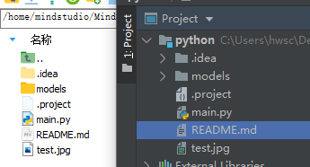

命令行输入运行命令运行项目，结果保存在图片result.jpg中

```
python3.7 main.py
```

