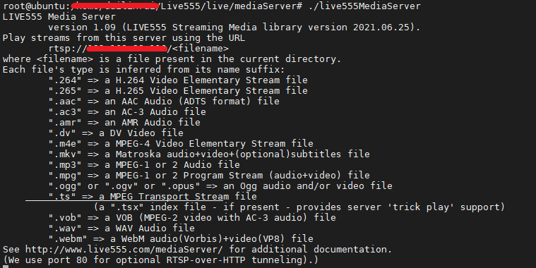
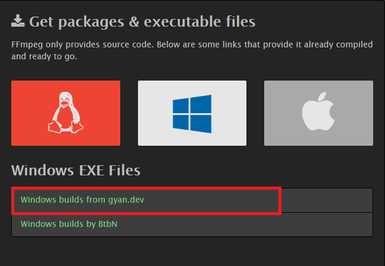
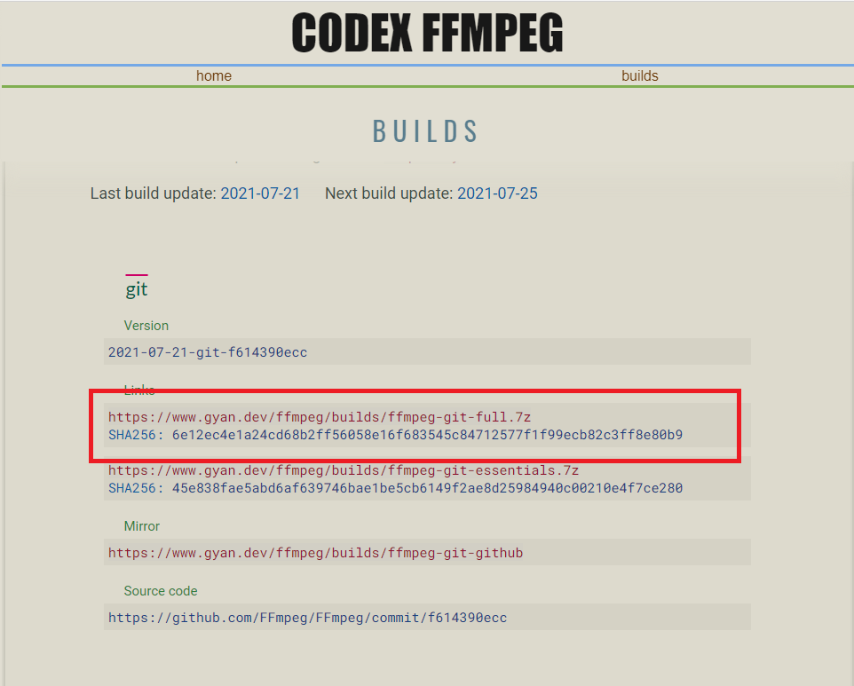
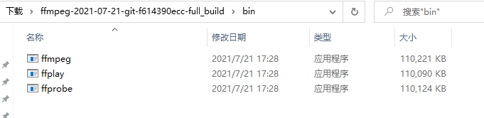
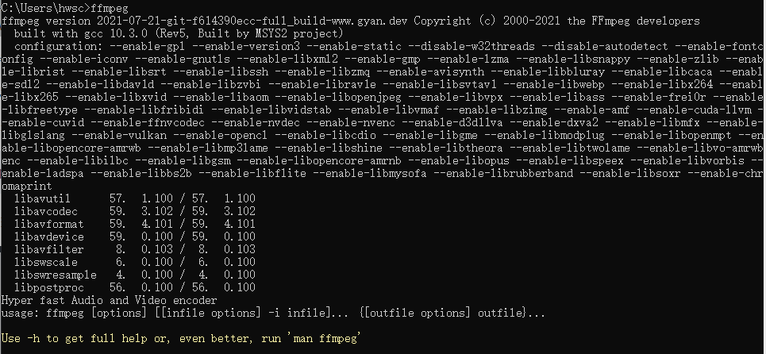

# Live555离线视频转RTSP说明文档

## 1.下载安装包

[http://www.live555.com/liveMedia/public/live555-latest.tar.gz](https://bbs.huaweicloud.com/forum/thread-68720-1-1.html#)

## 2. 解压

执行命令：

```
tar -zxvf live555-latest.tar.gz

cd live/
```

## 3. 编译并安装

执行命令：

```
./genMakefiles linux  #注意后面这个参数是根据当前文件夹下config.<后缀>获取得到的,与服务器架构等有关。

make
```

最后就会在当前目录下生成mediaServer 文件夹，有一个live555MediaServer可执行文件

## 4. 运行

执行命令（所有的视频文件放在mediaServer文件夹同一目录下），产生的RTSP流的地址如下图所示，文件名为上一步放入mediaServer 文件夹的视频文件。

```
cd mediaServer

./live555MediaServer
```



其中rtsp_Url的格式是 rtsp://host:port/Data，host:port/路径映射到mediaServer/目录下，Data为视频文件的路径。

## 5. 视频文件格式转换

根据提示当前只支持部分视频格式，并不支持.mp4后缀的文件，但可以通过ffmpeg转换生成[ffmpeg安装教程](##3.-pc端ffmpeg安装教程)，如下所示为MP4转换为h.264命令：

```
ffmpeg -i test.mp4 -vcodec h264 -bf 0 -g 25 -r 10 -s 1280*720 -an -f h264 test1.264

//-bf B帧数目控制，-g 关键帧间隔控制，-s 分辨率控制 -an关闭音频， -r 指定帧率
```

# 补充

## 1. 视频循环推流

按照以下提示修改文件可以使自主搭建的rtsp循环推流，如果不作更改，则为有限的视频流

在liveMedia库下的ByteStreamFileSource.cpp文件中的95行，找到

```
void ByteStreamFileSource::doGetNextFrame() {

if (feof(fFid) || ferror(fFid) || (fLimitNumBytesToStream && fNumBytesToStream == 0))
{
    handleClosure();
    return;
 }
```

更改为

```
void ByteStreamFileSource::doGetNextFrame() {

if (feof(fFid) || ferror(fFid) || (fLimitNumBytesToStream && fNumBytesToStream == 0)) {
    //handleClosure();**
    //return;**
    fseek(fFid, 0, SEEK_SET);
 }
```

## 2. 高分辨率帧花屏

在使用Live555进行拉流时，出现”**The input frame data was too large for our buffer**“问题，导致丢帧。

解决办法：

在mediaServer的DynamicRTSPServer.cpp文件，修改每一处OutPacketBuffer::maxSize的值，目前更改到800000。


### **源代码修改后都需要重新编译并安装live555.**

```
./genMakefiles <os-platform>
make
```

## 3. pc端ffmpeg安装教程

ffmpeg官网下载地址：https://ffmpeg.org/download.html





点击链接下载即可

把下载得到的7z压缩包解压到文件夹，进入解压后的文件夹，找到bin文件夹，然后将里面的三个exe文件悉数复制到你的 Windows\system32\ 文件夹中



打开控制台，输入ffmpeg命令得到一下信息时说明FFmpeg安装正确，可以使用了。


