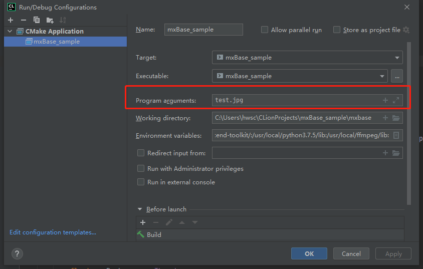
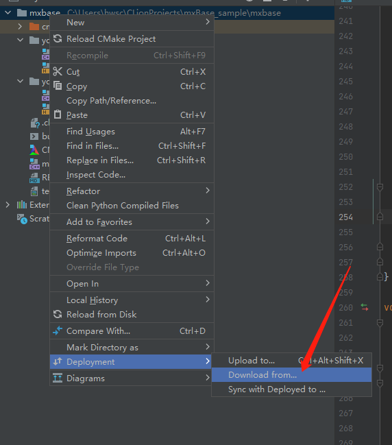
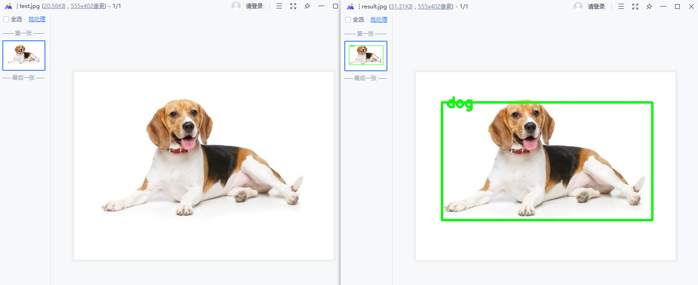

## 5.1.1 样例介绍
本开发样例是基于mxBase开发的端到端推理的C++应用程序，可在昇腾芯片上进行 yolov3 目标检测，并把可视化结果保存到本地。
[样例获取](https://gitee.com/ascend/mindxsdk-referenceapps/tree/master/tutorials/mxBaseSample)
该Sample的主要处理流程为：
Init > ReadImage >Resize > Inference >PostProcess >DeInit

## 2.1.2 运行前准备
参考[IDE开发环境搭建](./1-2IDE开发环境搭建.md)章节搭建好项目运行环境。
参考[CMake介绍](./Cmake介绍.md)修改CMakeLists.txt文件。
```
set(MX_SDK_HOME ${SDK安装路径})需要将${SDK安装路径}替换为具体的SDK安装路径
```
### 2.1.2.1 模型转换

若使用A200I DK A2运行，推荐使用PC转换模型，具体方法可参考A200I DK A2资料。

**步骤1** 在ModelZoo上下载YOLOv3模型。[下载地址](https://mindx.sdk.obs.cn-north-4.myhuaweicloud.com/mindxsdk-referenceapps%20/contrib/ActionRecognition/ATC%20YOLOv3%28FP16%29%20from%20TensorFlow%20-%20Ascend310.zip)

**步骤2** 将获取到的YOLOv3模型pb文件存放至："项目目录中的models文件夹中"。

**步骤3** 模型转换
具体模型转换步骤请样例项目目录下的README.md文件  

### 2.1.2.2 配置Clion运行配置
参考[IDE开发环境搭建](./1-2IDE开发环境搭建.md)在Clion中添加环境变量。(${MX_SDK_HOME}需要替换为具体的SDK安装路径)
```
ASCEND_HOME=/usr/local/Ascend
ASCEND_VERSION=nnrt/latest
ARCH_PATTERN=.
LD_LIBRARY_PATH=${MX_SDK_HOME}/lib/modelpostprocessors:${MX_SDK_HOME}/lib:${MX_SDK_HOME}/opensource/lib:/usr/local/Ascend/ascend-toolkit/latest/acllib/lib64:/usr/local/Ascend/ascend-toolkit/:/usr/local/python3.9.2/lib:
```
点击Clion任务栏 Run->Edit Configurations->Working directory 填写当前工程目录位置。在Program arguments处填入输入参数./test.jpg


## 2.1.3 项目运行
完成前置步骤后，点击build->build Project成功后，点击Run->Run"xxxx"（项目名称）运行项目。
  
成功运行项目后，程序会将检测结果保存在远程环境项目目录下result.jpg中。


右击工程 Deployment->Download from...，将远程生成的结果文件下载到本地中，同步两端文件，然后用户就可以在本地中查看项目运行结果了。
本样例中输出结果为在输入的test.jpg中，将可识别的对象画框并显示识别类型后输出的result.jpg  

