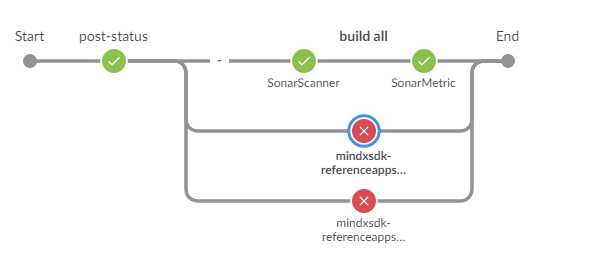
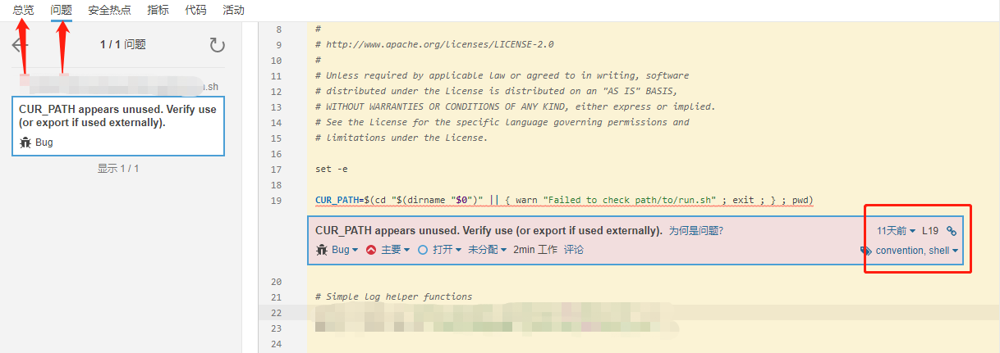

# 1 介绍

MindX SDK 欢迎开发者

本章主要介绍提交PR后清理告警步骤。

## 1.1 代码提交流程

先fork  Ascend / mindxsdk-referenceapps 仓库

clone 自己的仓库到本地

修改提交

提PR合并请求

等待检视，修改检视意见及门禁扫描问题后合并

#### 代码commit格式

```
【修改说明 Modification】 XXXXX
【修改人 Modifier】 XXX
```


## 1.2 添加编译检查路径

- 修改路径【mindxsdk-referenceapps/contrib/build_all.sh】中的buil_all.sh 文件，在sh文件20行SAMPLE_FOLDER中添加项目路径。

- 提交的C++代码需要提供一个编译执行的build.sh

说明：在build_all.sh中添加路径，执行编译检查的时候才能扫描到路径下的build.sh脚本，检查代码编译的相关问题。

eg:

```
SAMPLE_FOLDER=(
	/test1/
	/test2/
	/test3/
)
```


## 1.3 ascend-cla/no

CI门禁增加了i-robot对代码的扫描，但之前需要开发者签署开源协议CLA（Contributor License Agreement），否则会出现如下报错提示：


### 1.3.1 CLA内容

CLA 是每个公司或组织自定义的，在细节上可能稍有不同，不过总体都包含以下内容：

- 关于签署该 CLA 的主体和贡献的定义；
- 授予著作权给拥有该软件知识产权的公司或组织；
- 专利许可的授予；
- 签署者保证依法有权授予上述许可；
- 签署者确保所有的贡献内容均为原创作品；
- 签署者为贡献内容支持的免责描述；
- 说明贡献者提交非原创作品应该采用的方式；
- 保证在获悉任何方面不准确的事实或情况之时通知签约方；
- 对于主体在中国的企业，还加入了一些本地化的内容，如 Alibaba Open Source Individual CLA。

因为 CLA 分别为个人级和公司级，所以对于不同名义签署时需要提供不同的信息。签署个人级 CLA 的时候需要提供个人信息（姓名、地址、邮箱、电话等），签署公司级 CLA 还需要提供公司信息（名称、地址、联系电话、邮箱、传真等）；

### 1.3.2 **解决步骤：**

(1) 这个报错，请翻看评论，在其中找到 i-robot 成员评论点击here。


(2) 选择个人签署


(3) 浏览协议，填写信息并签署


(4) 在评论区评论：/check-cla，使签署生效


## 1.4 缺陷扫描&规范扫描

提交PR后，gitee会进行门禁扫描。点击缺陷扫描 -> 点击bug标题，在展开的代码中找到报错行。

规范扫描类似。


在本地修改后，push到自己仓库，会自动重启PR扫描。

## 1.5 AtlasAccount编译检查&静态检查

在PR评论的最下方，查看build Result 和Static Check。（如果没有账号请联系众智接口人获取）


(1) 点击Build Result 行的**#74**登录到编译检查页面


登录后查看编译问题。修改后push进行自动重新扫描。




(2) 点击Static Check 行的**#74**登录到静态扫描


登录后查看问题，总览里面有代码重复问题，问题里面有bug，都需要清理。




