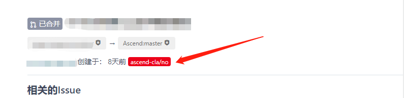
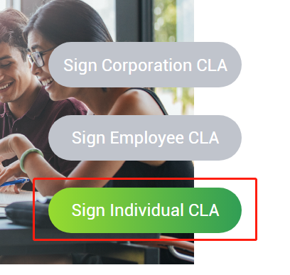
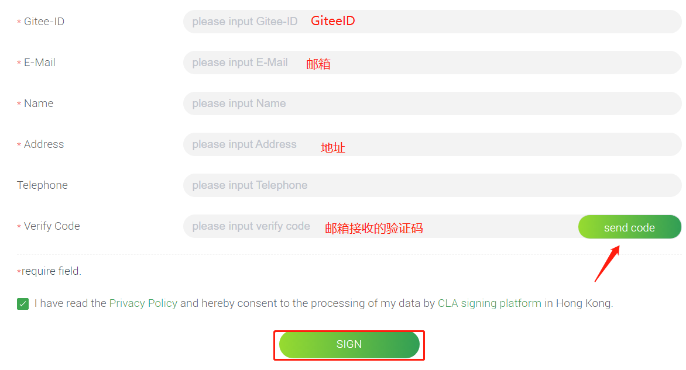
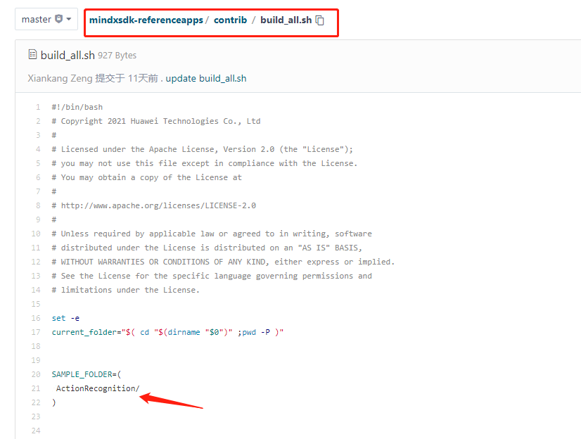

# 1 介绍

MindX SDK 欢迎开发者

本章主要介绍提交PR后清理告警步骤。

## 1.1 代码提交流程

**步骤一** fork主仓 Ascend / mindxsdk-referenceapps 到个人分支

**步骤二** 使用 git 克隆自己的仓库到本地，命令如下：		

```
git clone https://gitee.com/xxxxxx/mindxsdk-referenceapps.git
```

**步骤三** 将个人开发项目放在本地代码仓库相应目录下，众智参考设计代码目录为mindxsdk-referenceapps/contrib/

**步骤四** 使用 git 将本地仓库新增代码推送至远端仓，命令如下：

```
git add .
git commit -m "xxxxx"
# commit格式
#【修改说明 Modification】 XXXXX
#【修改人 Modifier】 XXX
git push
```

**步骤五** 提PR合并请求

新建Pull Request


PR标题模板

```
 [xxx学校] [xxx参考设计]
```

PR内容模板

```
### 相关的Issue

### 原因（目的、解决的问题等）

### 描述（做了什么，变更了什么）

### 测试用例（新增、改动、可能影响的功能）
```

**步骤六** PR提交后，成功触发CI门禁，解决门禁检查出的问题。CI门禁触发及问题修改参见以下指导

## 1.2 CLA检查

### 1.2.1 CLA内容

CI门禁增加了i-robot对代码的扫描，但之前需要开发者签署开源协议CLA（Contributor License Agreement），否则会出现如下报错提示：



CLA 是每个公司或组织自定义的，在细节上可能稍有不同，不过总体都包含以下内容：

- 关于签署该 CLA 的主体和贡献的定义；
- 授予著作权给拥有该软件知识产权的公司或组织；
- 专利许可的授予；
- 签署者保证依法有权授予上述许可；
- 签署者确保所有的贡献内容均为原创作品；
- 签署者为贡献内容支持的免责描述；
- 说明贡献者提交非原创作品应该采用的方式；
- 保证在获悉任何方面不准确的事实或情况之时通知签约方；
- 对于主体在中国的企业，还加入了一些本地化的内容，如 Alibaba Open Source Individual CLA。

因为 CLA 分别为个人级和公司级，所以对于不同名义签署时需要提供不同的信息。签署个人级 CLA 的时候需要提供个人信息（姓名、地址、邮箱、电话等），签署公司级 CLA 还需要提供公司信息（名称、地址、联系电话、邮箱、传真等）；

### 1.2.2 **解决步骤：**

(1) 这个报错，请翻看评论，在其中找到 i-robot 成员评论点击here。


(2) 选择个人签署



(3) 浏览协议，填写信息并签署




(4) 在评论区评论：/check-cla，使签署生效

## 1.3 添加编译检查路径 

> **C++必需**

- 修改路径【mindxsdk-referenceapps/contrib/build_all.sh】中的buil_all.sh 文件，在sh文件20行SAMPLE_FOLDER中添加项目路径。

- 提交的C++代码需要提供一个编译执行的build.sh

说明：在build_all.sh中添加路径，执行编译检查的时候才能扫描到路径下的build.sh脚本，检查代码编译的相关问题。

```
SAMPLE_FOLDER=(
	test1/
	test2/
	test3/
)
```



## 1.4 其它CI门禁检查

 PR提交成功后，会触发编译检查、静态检查等一系列代码检查，如下图所示：


点击 **FAILURE** 检查项后的 **详情见此处** 链接，进入到对应检查页面（账号请联系支撑人员获取）


以代码检查页面为例，可根据问题描述与规则修改相应代码


所有检查项都需修改至 **SUCCESS**

若门禁未触发或触发异常，可参见 [MindX SDK常见问题FAQ-PR提交](https://gitee.com/ascend/mindxsdk-referenceapps/blob/master/docs/MindX SDK常见问题FAQ/MindX SDK常见问题FAQ.md#6-pr提交) 部分

