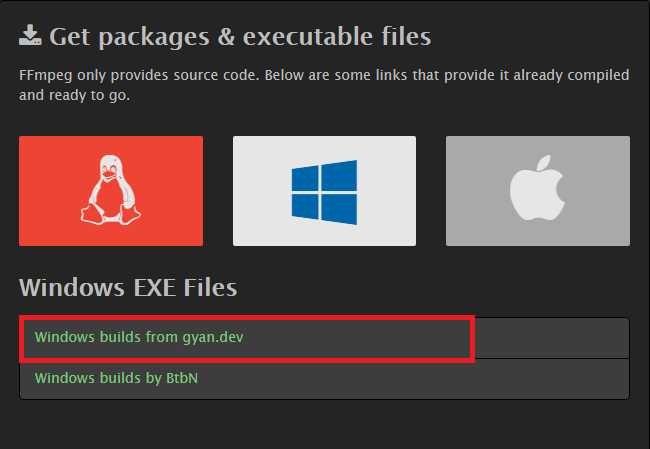
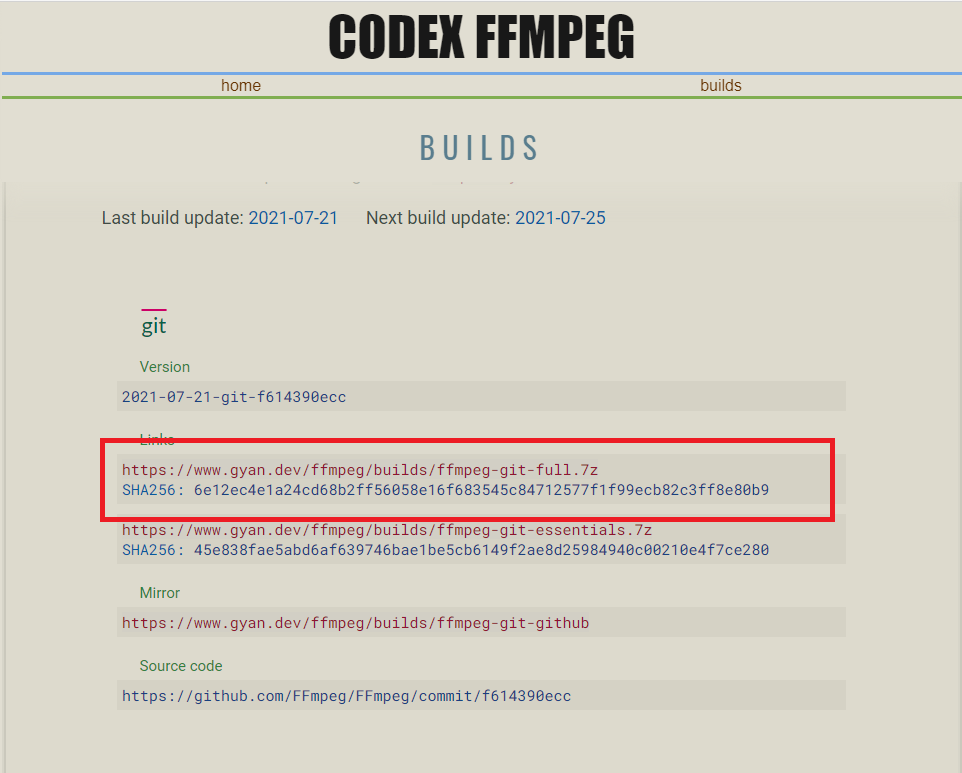
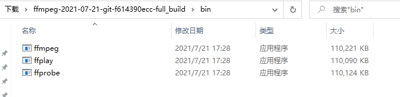
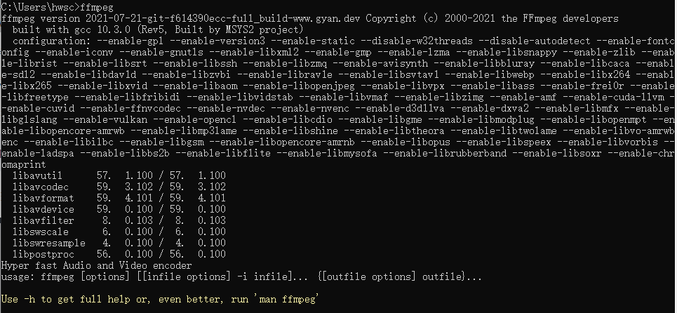

# pc端ffmpeg安装教程

## 1. 下载安装包

ffmpeg官网下载地址：https://ffmpeg.org/download.html

点击链接下载即可

## 2. ffmpeg安装

把下载得到的7z压缩包解压到文件夹，进入解压后的文件夹，找到bin文件夹，然后将里面的三个exe文件悉数复制到你的 Windows\System32\ 文件夹中

打开控制台，输入ffmpeg命令得到一下信息时说明FFmpeg安装正确，可以使用了。

